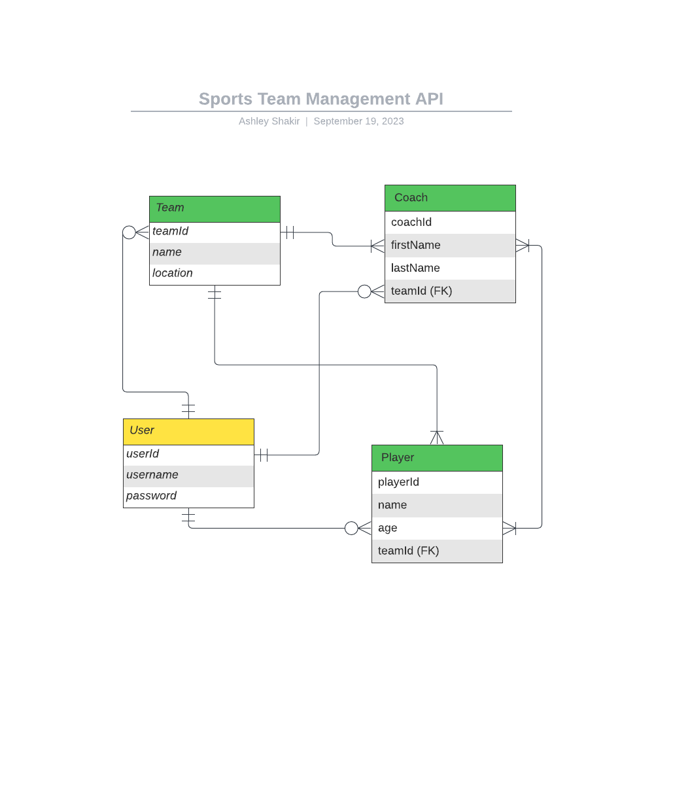

# Team Management Web Application

## Project Description
The Team Management Web Application is a monolithic backend developed using Spring Boot that provides a RESTful API which allows admin users to create and manage youth sports teams. Users can register, create teams, assign coaches, and add players to their teams. This application simplifies team management for coaches and team managers and allows players to view their assigned team and coaches.

## Tools and Technologies Used
- **Spring Boot:** Powers the backend.
- **H2 Database:** Manages data storage.
- **Spring Security:** Ensures data security.
- **JWT Tokens:** Provides authentication and authorization.
- **Tomcat Server:** Hosts the application.
- **MVC Architecture:** Follows a clean code structure.
- **Documentation:** Well-documented codebase.
- **GitHub:** Version control and collaboration platform.
- **Spring RESTful API:** Offers user-friendly interaction.

## Project Approach
I started the project by defining user stories and creating an Entity-Relationship Diagram (ERD) to design the database schema. I also created a GitHub Project to break the project down into deliverables and timelines. The project included the following columns: Todo, In Progress, Done, and Tested. Taking the time to write out the planning documentation allowed me to complete each part of the project in the correct order, minimizing errors and creating a steady workflow. 

### User Stories

For user stories, please refer to this [User Stories document](User Stories.txt).

### ERD Diagram

### Planning Documentation

My project planning and management was done using GitHub Projects. You can find my detailed scope, schedule, and deliverables in the [GitHub Project](https://github.com/users/ashleyshakir/projects/1).

## Hurdles
- **Hurdle:** Initially, I named the ID column for the User entity as "userId" and for the Team entity as "teamId." This decision led to issues when creating custom findBy methods in the team repository. I intended to use findByNameAndId, but I needed to use findByNameAndUser_UserId. This adjustment was necessary to instruct Spring Data JPA to search for the "UserId" property within the "User" property.

- **Lesson learned:** Spring Data JPA relies on the method name to auto-generate queries based on entity properties and method parameters. Therefore, precise method naming is critical for Spring Data JPA to interpret the method correctly.
